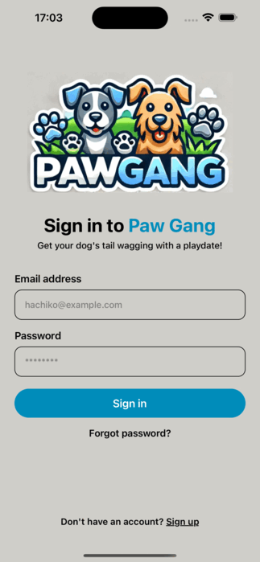

# Paw Gang: Dog Park Scheduler

PawGang is a unique mobile application designed for dog owners who want to schedule visits to dog parks and create social encounters for their furry friends. The app helps dog owners plan and coordinate visits, ensuring their pets can socialize, exercise, and have fun together.

## Key Features:

1. **Search Nearby Dog Parks**:
   - Easily search for dog parks near your location.
   - View park details, including photos, ratings, adress.

2. **Locate Me**:
   - Use your current location to find the nearest dog parks with a single tap.

3. **Plan Your Visit**:
   - Schedule visits to dog parks at specific times and dates.
   - View the park's schedule to see when other dogs will be visiting.

4. **Manage Your Plans**:
   - Keep track of all your planned visits to different dog parks.
   - Edit or cancel your plans as needed.

5. **Interactive Calendar**:
   - View park schedules and plan your visits with an easy-to-use calendar interface.

6. **User-Friendly Navigation**:
   - Simple tab navigation for easy access to search and plan features.
   - Intuitive design ensures a seamless experience for all users.

## How It Works:

- **Search for Parks**: Enter your location or use the "Locate Me" feature to find nearby dog parks.
- **View Park Details**: Check out photos, the adress, and ratings of the parks.
- **Plan Visits**: Use the "Plan visit 🐾" button to schedule your visit to the park.
- **Manage Visits**: View and manage all your planned visits in the "My Plans" section.
- **Park Schedule**: View the schedule of each park to see when other dogs will be visiting and plan accordingly.

PawGang is the perfect app for dog lovers who want to ensure their pets have plenty of opportunities to socialize and play with other dogs. Plan your visits, meet other dog owners, and let your furry friends have a great time at the park!